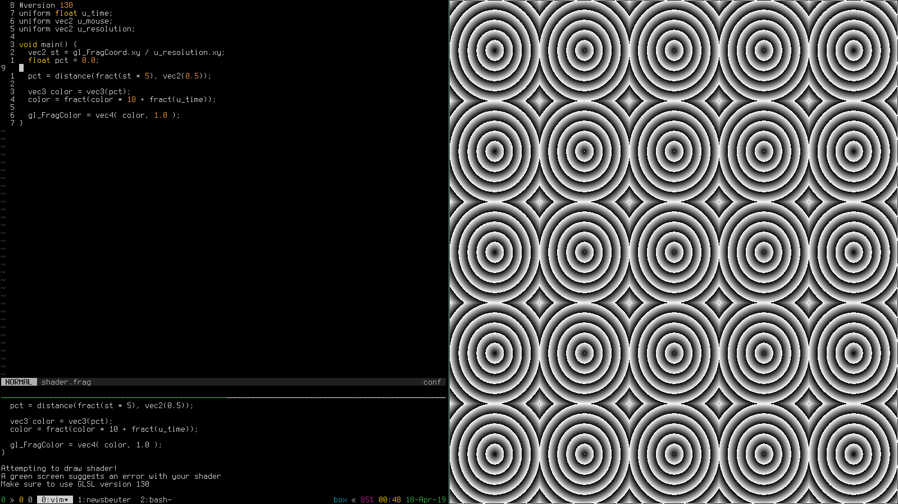

**VERY EARLY DEVELOPMENT**
# fragFrame 0.01
*A quick way to experiment with frag shaders*

fragFrame is a quick way to create interesting patterns with frag shaders. It is currently in very early stages of development.

## Requirements
* GNU/Linux
* make
* gcc
* libglfw3
* libglfw3-dev
* libglew2.0
* libglew-dev
* entr

## How to use
Install dependancies

`sudo apt-get install libglfw3 libglfw3-dev libglew2.0 libglew-dev entr`

Make fragframe

`make`

Run fragframe

`./fragframe_run.sh`

Edit `shader.frag` and your frame will automatically update

## Notes
* If you are using vim and want syntax highlighting, add the following to your vimrc:

`au BufReadPost *.frag set syntax=c`
